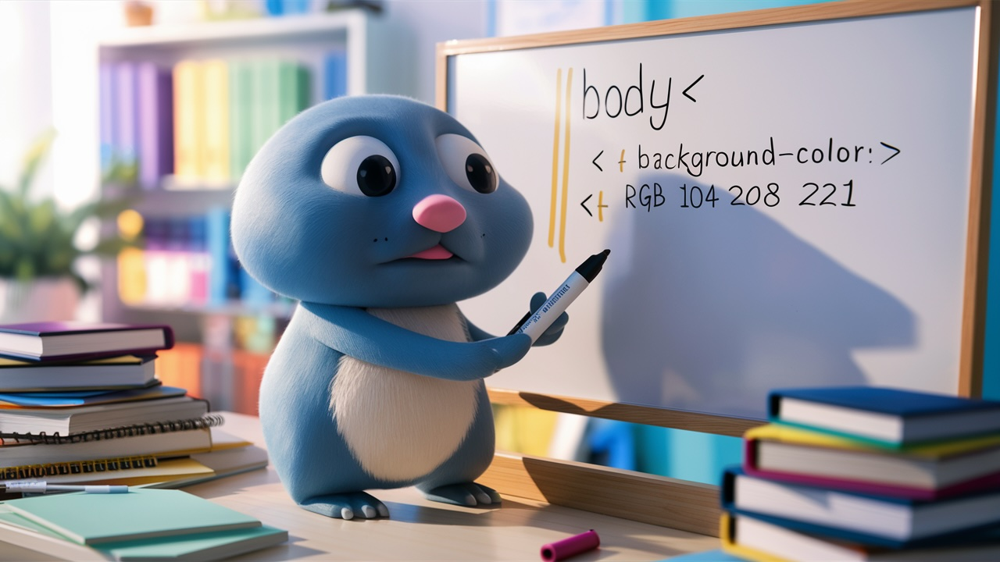

[](https://github.com/AccentDesign/gcss/actions/workflows/go-test.yml)
[](https://goreportcard.com/report/github.com/AccentDesign/gcss)
<a href="https://pkg.go.dev/github.com/AccentDesign/gcss"></a>



# gcss

CSS written in Pure Go.

No JS builders, no preprocessors, no linters, no frameworks, no classes, no variables, no overrides, no plugins, no dependencies, no javascript, no templates, no bs, no nothing.

Just Go.

## Motivation

This is really just a bit of fun and a way to write CSS in Go. I wanted to see if it was possible and it is with ease.
I wanted to find a way to easily control the CSS from the server side and not have to worry about pre-building the css to take variables and stuff.
I didnt want to use UI libraries that are written for JS frameworks and I didn't want to use preprocessors or linters that add more steps to the build process.

Could I just use CSS? Yes of course and I will, but I wanted to see if I could write CSS in Go as this is what is compiling the rest of the project.

## Gopher

No it looks nothing like the Go gopher, but it's a gopher and I like it. It's the best I could get from the LM without giving up, [ideogram.ai (1400097641)](https://ideogram.ai/g/E-5MQp7QTPO4uyF9PvERzw/3).
## Next steps

The next steps for this project are to add more features to the CSS package.
This includes adding support for more CSS properties and maybe mixins.
What I don't want to do is to add support for all CSS functionality as some things are better in CSS, but I do want to be able to create 
a few UI components that are configurable using Go.

## What I don't need

* I don't need UI libs that are written for the purpose of JS frameworks. 
* I don't need linters when I have Go's static typing.
* I don't need javascript to generate CSS.
* I don't need templates with 400 css classes in them.
* I don't need css with more variables in them than actual css properties.

## What I do need

* Go's static typing.

## Installation

```bash
go get github.com/AccentDesign/gcss
```

## Usage

There are multiple ways you can use `gcss` in your project. For examples of property values, see the `style_test.go` file.

Writing css to a file:

```go
package main

import (
	"github.com/AccentDesign/gcss"
	"github.com/AccentDesign/gcss/props"
	"github.com/AccentDesign/gcss/variables"
	"os"
)

type Stylesheet []gcss.Style

var styles = Stylesheet{
	{
		Selector: "html",
		Props: gcss.Props{
			FontFamily: props.FontFamilySans,
		},
	},
	{
		Selector: ".button",
		Props: gcss.Props{
			BackgroundColor: variables.Zinc800,
			Border: props.Border{
				Width: props.UnitPx(1),
				Style: props.BorderStyleSolid,
				Color: variables.Zinc900.Alpha(128),
			},
			BorderRadius:  variables.Size1H,
			Color:         variables.White,
			FontSize:      variables.Size4,
			PaddingBottom: variables.Size3,
			PaddingLeft:   variables.Size5,
			PaddingRight:  variables.Size5,
			PaddingTop:    variables.Size3,
		},
	},
	{
		Selector: ".button:hover",
		Props: gcss.Props{
			BackgroundColor: variables.Zinc900,
		},
	},
}

func main() {
	file, err := os.Create("stylesheet.css")
	if err != nil {
		panic(err)
	}
	defer file.Close()

	for _, style := range styles {
		if err := style.CSS(file); err != nil {
			panic(err)
		}
	}
}
```

## The benefit of all this are

* Keeps the css free of variables.
* Keeps html free of classes like `bg-gray-50 text-black dark:bg-slate-800 dark:text-white` and eliminates the need to remember to add the dark variant.
* I recently saw a button component on an html page 10 times with over 1800 characters in the class attribute of each. This is not maintainable nor debuggable.
* Keeps the css clean and easy to debug with no overrides like the above.
* Allows for easy theming based on server side logic.

## Examples

For example usage see the [examples](./examples) directory that include:

* [CSS resets](./examples/css-resets) - A simple example collection of css resets.
* [Themed CSS using multiple HTTP handlers](./examples/themed-multiple-http-handlers) - An example of how to use multiple http handlers to serve different themes.
* [Themed CSS using a single HTTP handler](./examples/themed-single-http-handler) - An example of how to use a single http handler to serve different themes using media queries.
* [Write to a file](./examples/to-file) - An example of how to write to a file.
* [Write to an HTTP handler](./examples/to-http-handler) - An example of how to write to an http handler.
* [Write to stdout](./examples/to-stdout) - An example of how to write to stdout.

## Contributing

If you would like to contribute to this project, please open an issue or a pull request. We welcome all contributions and ideas.

## Mix it up with other CSS frameworks

You can mix `gcss` with other CSS frameworks like `tailwindcss` for example:

separate the css files into base and utils:

```css
/* base.css */
@tailwind base;
```

```css
/* utils.css */
@tailwind utilities;
```

Then add the `gcss` styles in between in your html:

```html
<link rel="stylesheet" href="base.css" />
<link rel="stylesheet" href="gcss-styles.css" />
<link rel="stylesheet" href="utils.css" />
```

Try to keep the specificity of the `gcss` styles to 1 by using single classes this will ensure any `tailwindcss` utilities
will be able to overwrite your styles where required.
